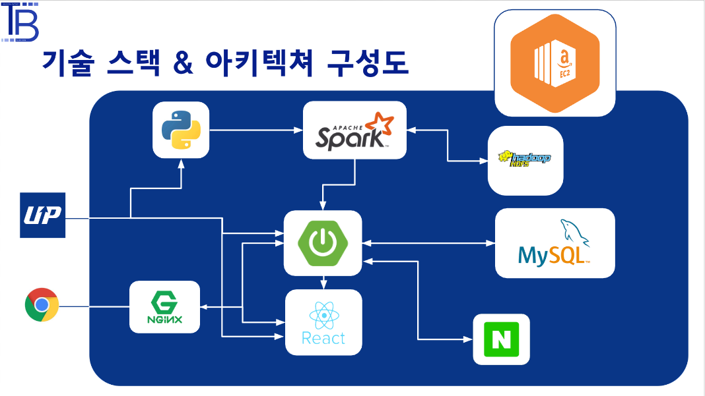
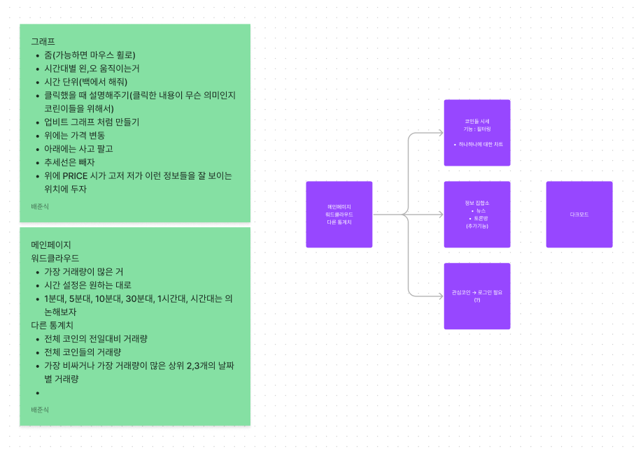
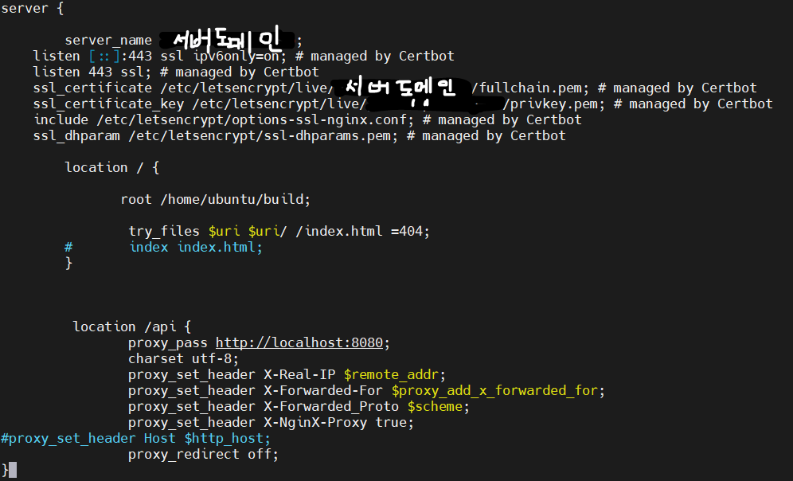
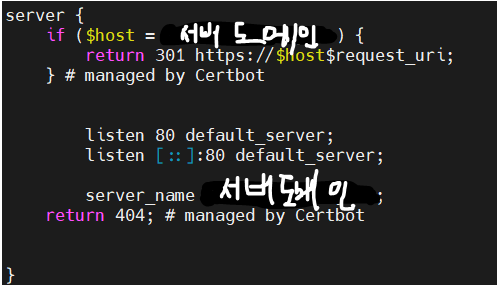
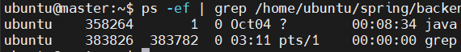

# 프로젝트 제목

📆 **프로젝트 진행기간 : 2022/07/11 ~ 2022/08/19**

**FE: 배준식, 석민형**

**BE: 김효근, 김혜라**

**기술: 권민용, 황인빈**


## 소개


## 주요 기능


## 개발 환경

###  Backend

- SpringBoot 2.4.5
- Java 1.8
- Type: Gradle
- Packiging: jar
- IntelliJ IDEA : 22.2.1
- MySQL Workbench: 8.0.28
- JPA
- JWT
- Lombok
- SWAGGER 2
- Spark : 3.3.0

###  Frontend

- 

### Tech

- Hadoop 3.2.3
- Spark 3.1.3


### CI/CD

- Amazon EC2 - Ubuntu 20.04
- Nginx - 
- docker - 


## 서비스 아키텍처




## 협업 툴

- Gitlab
- Jira
- Notion
- Figma
- Swagger
- Webex
- Google Sheet


## 와이어프레임 및 스토리보드

- 와이어 프레임



## 컨벤션

### - Git 컨벤션

------

```plaintext
################
# <type>(<scope>) : <subject>
# 제목은 50자 이내 / 변경사항이 "무엇"인지 명확히 작성 / 끝에 마침표 X
# 타입과 제목은 필수 / 범위는 선택
# 예) feat : 로그인 기능 추가


# 바로 아래 공백 유지 (제목과 본문의 분리를 위함)

################
# Body Message (선택사항)
# 본문(구체적인 내용)을 아랫줄에 작성
# 여러 줄의 메시지를 작성할 땐 "-"로 구분 (한 줄은 72자 이내)

################
# 꼬릿말(footer)을 아랫줄에 작성 (현재 커밋과 관련된 이슈 번호 추가 등)
# 예) Close #7

# Issue Tracker Number or URL

# --- COMMIT END ---
# <type> list
#   feat    : 새로운 기능
#   fix     : 버그
#   refactor: 코드 리팩토링
#   style   : 코드 의미에 영향을 주지 않는 변경사항 (형식 지정, 세미콜론 누락 등)
#   docs    : 문서의 추가, 수정, 삭제
#   test    : 테스트 추가, 수정, 삭제 (비즈니스 로직에 변경 없음)
#   chore   : 기타 변경사항 (빌드 부분 혹은 패키지 매니저 수정사항)
# ------------------
# Remember me ~
#   Capitalize the subject line
#     제목 첫 글자를 대문자로
#   Use the imperative mood in the subject line
#     제목은 명령문 사용 (과거형 X)
#   Do not end the subject line with a period
#     제목 끝에 마침표(.) 금지
#   Separate subject from body with a blank line
#     제목과 본문을 한 줄 띄워 분리하기 (빈 행으로 구분)
#   Use the body to explain what and why vs. how
#     본문은 "어떻게" 보다 "무엇을", "왜"를 설명한다.
#   Can use multiple lines with "-" for bullet points in body
#     본문에 여러줄의 메시지(목록)를 작성할 땐 "-"로 구분
# ------------------

```

### - Code 컨벤션

------

- Front-End
- Back-End

### - Jira 컨벤션

- 


## Notion


## ERD


## 배포 설정

### NGINX





### SPRING

- gradle의 bootjar 명령어로 jar 파일 생성

- 해당 jar 파일을 EC2 안에서 실행

- jar 파일 실행하기 위해서는 java 설치가 필요함

- ```bash
  nohup java -jar /home/ubuntu/{jar파일경로/jar파일이름} &
  ```

- nohup + 맨 마지막에 한칸 띄우고 &를 붙여줘야 백그라운드 실행이 됌

- 이미 배포된 jar가 있다면

- ```bash
  ps -ef | grep {jar파일경로}
  ps -ef | grep /home/ubuntu/spring/backend-0.0.1-SNAPSHOT.jar
  ```

- 명령어를 통해 실행중인 jar 파일의 PID를 구할 수 있다.

- 구한 PID를 죽이고 새로 jar를 실행시켜야하므로

- ```bash
  kill -9 {PID}
  ```

- 죽이고 재배포

- 

- 첫번째 숫자가 PID이다.
